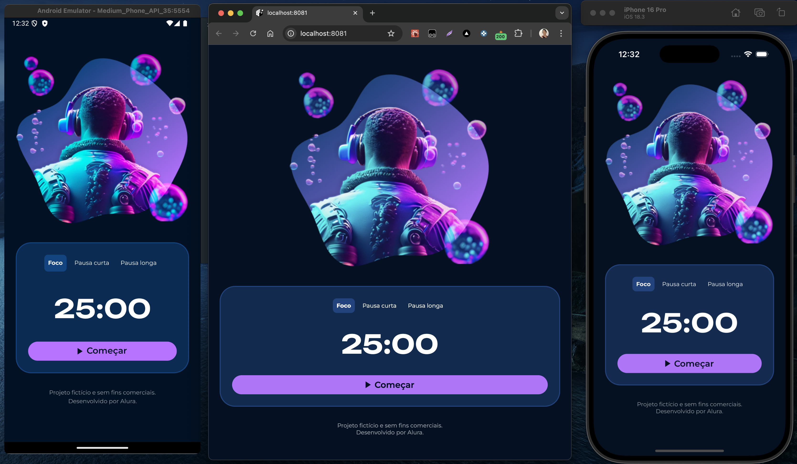

# Fokus

## Contexto

Fokus é um projeto desenvolvido como parte dos estudos para o curso da Alura de React Native com Expo e do terceiro módulo da pós-graduação em Front-end Engineering pela FIAP.

Trata-se de um aplicativo desenvolvido com React Native, projetado para auxiliar na gestão de sessões de foco utilizando a técnica Pomodoro.

### Prévia (iOS - Web - Android)
 


&nbsp;

## Funcionalidades

Iniciar e pausar o temporizador Pomodoro <br>
Alternar entre modos de "Foco", "Pausa curta" e "Pausa longa" <br>
Interface responsiva e intuitiva

&nbsp;

## Tecnologias usadas

**React Native:** framework baseado em React para criar aplicativos nativos para Android e iOS usando JavaScript.

**TypeScript:** superset do JavaScript que adiciona tipagem estática ao código;

**Expo:** uma plataforma que facilita o desenvolvimento com React Native, oferecendo ferramentas e serviços para build, preview e publicação do app.

&nbsp;

## Como Executar o Projeto

1. Clone o repositório:

```bash
git clone https://github.com/FehSouza/fokus.git
```

2. Acesse o diretório do projeto:

```bash
cd fokus
```

3. Instale as dependências:

```bash
pnpm install
```

4. Execute a aplicação:

   4.1. iOS:

   ```bash
   pnpm run ios
   ```

   4.2. Android

   ```bash
   pnpm run android
   ```

   4.3. Web

   ```bash
   pnpm run web
   ```
