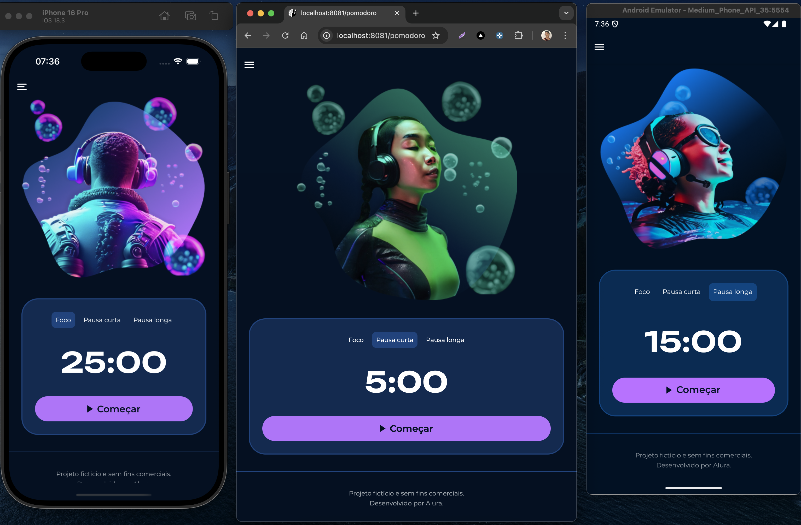
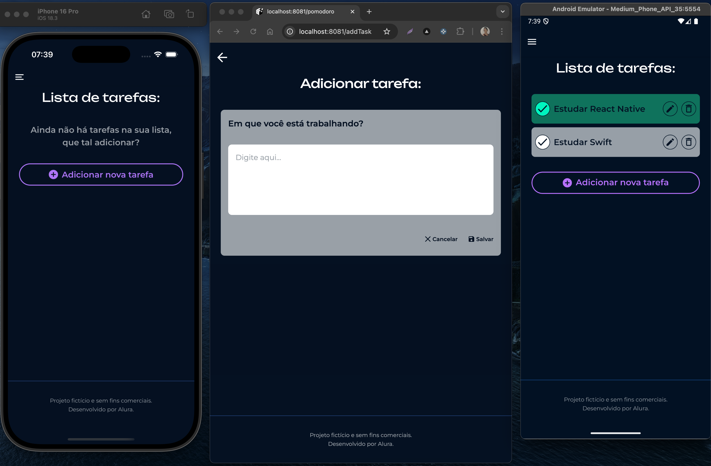

# Fokus

## Contexto

Fokus é um aplicativo de produtividade desenvolvido com React Native e Expo, que combina a técnica do Pomodoro com um gerenciador de tarefas. A proposta é ajudar o usuário a manter o foco nas atividades importantes, com uma experiência fluida e intuitiva em dispositivos móveis.

&nbsp;

### Prévias (iOS - Web - Android)




&nbsp;

## Funcionalidades

✅ Tela de boas-vindas ao iniciar o app

⏱️ Temporizador com ciclos de "Foco", "Pausa curta" e "Pausa longa" (técnica Pomodoro)

📋 Tela de tarefas com:

- Adição de novas tarefas;

- Edição e exclusão de tarefas;

- Marcação de tarefas como concluídas/não concluídas e

- Persistência dos dados com AsyncStorage.

📂 Navegação com drawer menu

☁️ Salvamento de estado global com Context API

&nbsp;

## Tecnologias usadas

**React Native:** framework baseado em React para criar aplicativos nativos para Android e iOS usando JavaScript;

**Expo:** ferramenta que simplifica o ambiente de desenvolvimento e execução com React Native;

**Expo Router:** estrutura de navegação baseada em arquivos, usada para organizar as rotas do app;

**AsyncStorage:** armazenamento local de dados persistentes no dispositivo;

**Context API:** gerenciamento de estado global sem bibliotecas externas;

**TypeScript:** superset do JavaScript que adiciona tipagem estática ao código.

&nbsp;

## Aprendizados

Este foi meu primeiro projeto com React Native, desenvolvido durante meus estudos com a Alura e na pós-graduação em Front-End Engineering da FIAP.

Durante o desenvolvimento, aprendi os fundamentos do React Native com Expo e como estruturar um projeto mobile. Em uma segunda fase do projeto, aprofundei meus estudos com Context API para o gerenciamento de estado e AsyncStorage para a persistência de dados locais. Também explorei o uso de navegação do tipo drawer, prática que foi apresentada no módulo sobre navegação mobile da pós.

&nbsp;

## Como Executar o Projeto

1. Clone o repositório:

```bash
git clone https://github.com/FehSouza/fokus.git
```

2. Acesse o diretório do projeto:

```bash
cd fokus
```

3. Instale as dependências:

```bash
pnpm install
```

4. Execute a aplicação:

   4.1. iOS:

   ```bash
   pnpm run ios
   ```

   4.2. Android

   ```bash
   pnpm run android
   ```

   4.3. Web

   ```bash
   pnpm run web
   ```

5. Abra o aplicativo com o Expo Go no seu celular ou use um emulador.
